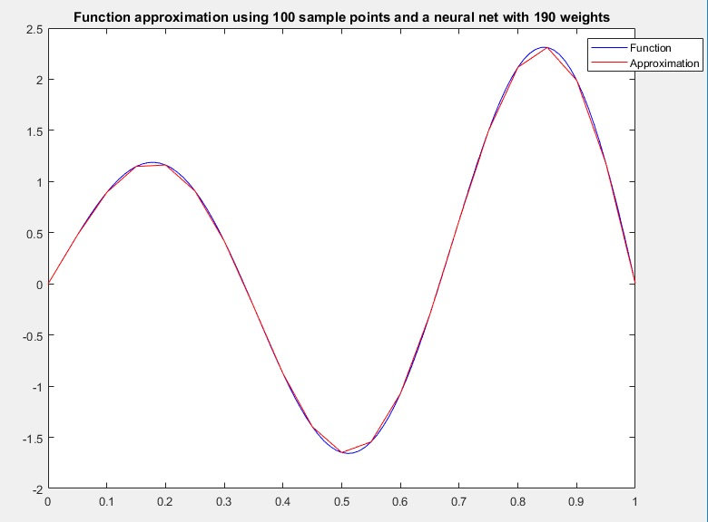

# Neural Nets

In this project I accomplished two goals:

## Using a Two Layer Neural Net as a function approximator

Without using tools from MATLAB's neural net toolbox, I created a two-layer neural net that computes a piecewise linear approximation of an input function f. 

* layer 1 uses the ReLU nonlinearity
* layer 2 does not use nonlinearity since it uses the ReLU as the identity

### Example
{:height="50%" width="50%"}

## Training a Small Neural Net

A small neural net was trained on data with binary labels. Network structure and training parameters were tuned until achieving 97.12% testing accuracy. 

### Test Data
{:height="50%" width="50%"}

### Classification Results (97.12% accuracy)
{:height="50%" width="50%"}

